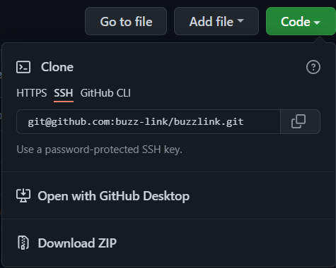

# BUZZLINK

## 1. Prerequisites

- Make sure to have the following tools installed on your machine before continuing:

  - Node.js
  - Composer
  - Docker
  - Git

## 2. Development Setup

### 1. Clone the project repository

1. On Github repository, copy clone URL as shown below (can choose either from `HTTPS` OR `SSH` depending on your set up):

<br />



<br />

2. On bash or powershell, set your current directory first on your preferred workspace, directory or folder
3. Run following command:
  ```
    git clone [url]
    // or
    git clone git@github.com:buzz-link/buzzlink.git
  ```
  Note:
  - For more information about cloning arepository, click this [link](https://github.com/git-guides/git-clone).

### 2. How to setup docker environment

1.  On project directory, go to `docker` folder

    ```
    cd  ./docker
    ```

2.  Run command below to start up docker containers (_make sure docker is running before executing the command_)

    ```
    docker-compose up -d
    ```

    Note:

    - At this time, schemaspy generates Database Scheme (found in `./docker/schemaspy/output`) from buzzlink database. If you want to regenerate schemaspy, excute `docker-compose up` again

3.  After all app containers are created successfully. You can try and access the following platforms below:

    | PLATFORM   | PORT           |
    | ---------- | -------------- |
    | php-apache | localhost:80   |
    | phpMyAdmin | localhost:8080 |

### 3. How to setup Laravel

- If you have accessed `php-apache` using `localhost:80` and an error about "**No such file or directory**" is displayed, follow instructions below:

- On project directory, go to `src` folder:

  1. Copy `.env.example` to `.env` and update contents, or paste [provided](#other-information) `.env` file

  2. Then run following commands:

     ```
     // For installing dependencies
     npm install
     composer install

     // For database migrations
     php artisan migrate

     // For compiling assets and hot-reload for development
     npm run watch
     ```

     Note:

     - On `.env` file, change `DB_HOST` from `mysql` to `127.0.0.1` for the following scenarios (then revert back to `mysql` if done and accessing website again):

       1. If an error displays about "**No such hosts is known**" after running `php artisan migrate` command.
       2. If doing any batch (`src/app/Console/Commands`) related tasks

     - If an error about view not found displays, run `composer dump-autoload` and refresh website

  3. After database migration, import SQL dump (will be [provided](#other-information)) for required initial data.
     1. For importing SQL dump, open `phpMyAdmin` using `localhost:8080`
     2. Click `buzzlink` database found in left sidebar
     3. Click `Import` on tab options on top
     4. On `Import` tab, click button `Choose File`
     5. Select SQL dump by double clicking the file or selecting the file then clicking button `Open` found in bottom right of screen
     6. Lastly, click button `Go` below at bottom right of screen
  4. Try and access website again. Happy coding!

### 4. How to use MinIO

- For more information about MinIO, click this [link](https://min.io/).

1. When `docker-compose up` command is ran:

   - MinIO creates bucket "**public-bucket**" and "**private-bucket**". Edit the policy of both buckets to `read and write` permission. You can do this by accessing MinIO browser on `localhost:9090` with the following information:

     - Access key: `minio`
     - Secret key: `minio123`

2. To use MinIO in Laravel, just update `.env` file with contents below (but possible to be included in the [provided](#other-information) `.env` for convenience):

   ```
   AWS_ACCESS_KEY_ID=minio
   AWS_SECRET_ACCESS_KEY=minio123
   AWS_DEFAULT_REGION=us-east-1
   AWS_PUBLIC_BUCKET=public-file
   AWS_PRIVATE_BUCKET=private-file
   AWS_URL_LOCAL=http://localhost:9090
   AWS_URL_DOCKER=http://minio:9000

   AWS_LOCAL_PUBLIC_URL="${AWS_URL_LOCAL}/${AWS_PUBLIC_BUCKET}"

   AWS_PUBLIC_URL="${AWS_URL_DOCKER}/${AWS_PUBLIC_BUCKET}"
   AWS_PRIVATE_URL="${AWS_URL_DOCKER}/${AWS_PRIVATE_BUCKET}"
   BUCKET_ENDPOINT=false
   USE_PATH_STYLE_ENDPOINT=true
   ```

### 5. Enable queue database

- You should use queue when you test sending email. The environment variable should be set in `.env` like below:

  ```
  QUEUE_CONNECTION=database
  ```

  Note:

  - "**database**" use queue in database and "**sync**" doesn't use queue

### 6. Buzzlink admin

- For more information about the packaged used for `Buzzlink admin`, click this [link](https://laravel-admin.org/docs/en/).
- You can access Buzzlink admin by using `localhost:80/admin` with the following login information below:

  - User ID: `admin`
  - Password: `admin`

- Make sure to have the environment variable below in `.env` file with correct value based on environnment (to properly load website and its assets)

  ```
  // Remote server, staging and production environment
  ADMIN_HTTPS=true

  // Local environment
  ADMIN_HTTPS=false
  ```

### 7. Additional environment variables

- Environment variables listed below is included in the [provided](#other-information) `.env` file
  | ENVIRONMENT VARIABLE | CONTENT |
  | -------------------- | ------------ |
  | BANK_CODE_JP_API_KEY | For accessing API from `https://bankcode-jp.com/` <br /> API link: `https://apis.bankcode-jp.com/`|
  | SENDGRID_API_KEY | For mail sending using SendGrid |
  | MIX_APP_STRIPE_API_KEY | Client-side key for Stripe |
  | STRIPE_SECRET_KEY | Server-side key for Stripe <br /> Package: [stripe/stripe-php](https://github.com/stripe/stripe-php)|

## Other information

- Click this [link](https://drive.google.com/drive/u/0/folders/1mdOELWl_31cRqrhFpWP-zD2UJgJCzm3i) for the provided `.env` and SQL dump (filename: `buzzlink-dev.dump.sql`) file
